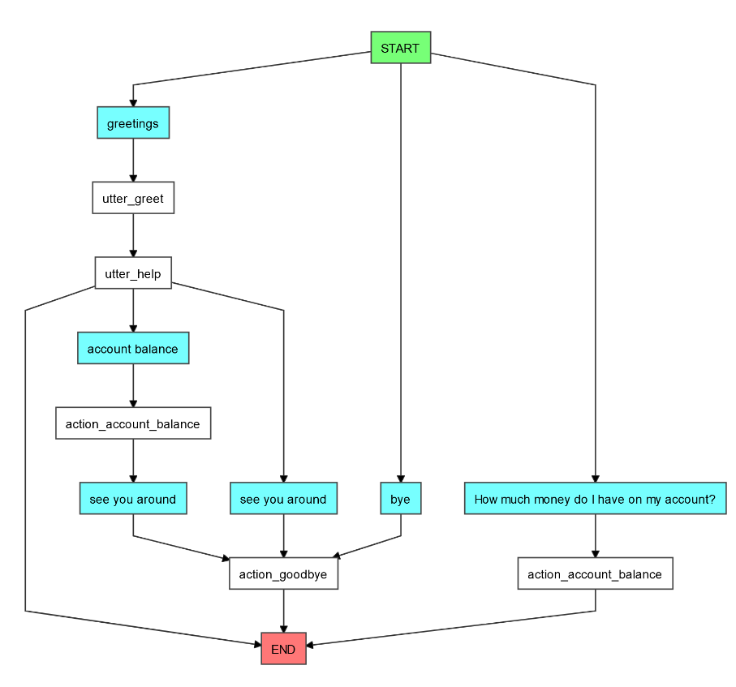

# Chatbot

## About
A financial assistant that serves basic banking functionalities to the customers.

## To build locally

****NOTE***: You must have docker installed to build locally*

To run the application locally, clone the repo and build using:

```bash
docker-compose build
```

Once build is complete, you can launch it by giving:

```bash
docker-compose up
```

You can then launch the app in your browser with the URL: [http://localhost:3000](http://localhost:3000)


## Tools used
* Database - MongoDB
* Front End - ReactJS
* Backend - NodeJs
* NLP - Rasa

Each of the components are containerized as individual docker images.

## Architecture

The architecture diagram is as follows:


1. The customer sends a message from the client (browser)
2. The server (NodeJS) sends the message to the NLU Server.
3. NLU Server responds back to the server either the response message or an action.
4. (Optional) If needed, the server fetches the required data from the DB.
5. (Optional) DB returns the requested data back.
6. The server then sends the final data as response back to the customer.

## Security
The client-server communication is secured by using JWT.


When a new customer starts up the conversation, a new token is generated. The generated token is then stored in local storage for further communication until it expires.

When a user resumes the chat-session before the token expiry, the token from the local storage will be validated (using validation API) and then used for communication.

### Token expiration policy
Current token expiry is set to ***2 hours***. Once the token is expired, then a new token has to be generated again.

### Auth APIs

The NodeJs server exposes the following two endpoints for token generation and validation respectively:

`/v1/jwt_auth/new_session`

`/v1/jwt_auth/verify_session`

### JWT Access Token Generation
Used the online generator https://www.csfieldguide.org.nz/en/interactives/rsa-key-generator/ to generate private & public key.

## Metrics APIs
The following APIs are used to obtain the metrics data

#### People who engaged with the bot:
`/v1/dashboard/engagement_rate`

#### People who dropped off:
`/v1/dashboard/drop_off_rate`

#### People who completed a chat:
`/v1/dashboard/completion_rate`

## Bot conversation visualization
The bot conversation graph is as follows.



## Accessing Mongodb & Schema
```bash
docker exec -it mongo-chatbot bash
```
